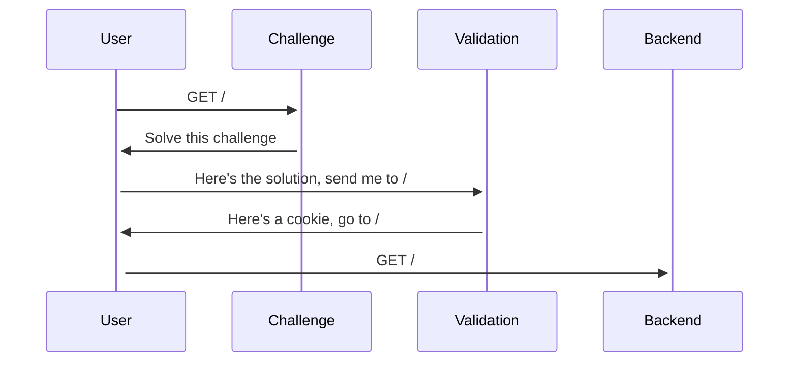
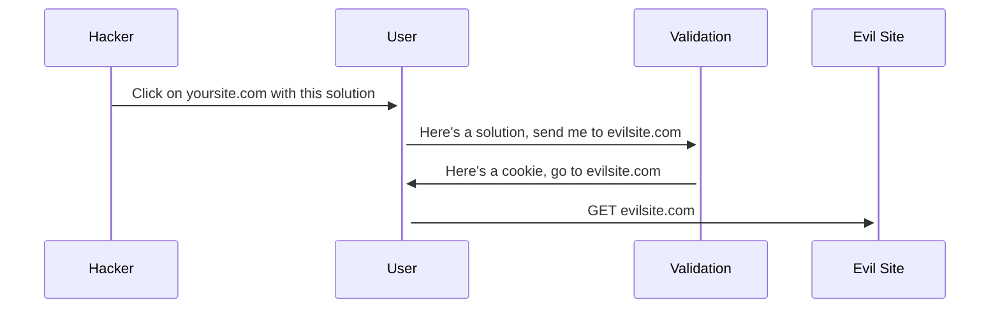

import Tabs from "@theme/Tabs";
import TabItem from "@theme/TabItem";

Anubis has an HTTP redirect in the middle of its check validation logic. This redirect allows Anubis to set a cookie on validated requests so that users don't need to pass challenges on every page load.

This flow looks something like this:



However, in some cases a sufficiently dedicated attacker could trick a user into clicking on a validation link with a solution pre-filled out. For example:



If this happens, Anubis will throw an error like this:

```text
Redirect domain not allowed
```

## Configuring allowed redirect domains

By default, Anubis will limit redirects to be on the same HTTP Host that Anubis is running on (EG: requests to yoursite.com cannot redirect outside of yoursite.com). If you need to set more than one domain, fill the `REDIRECT_DOMAINS` environment variable with a comma-separated list of domain names that Anubis should allow redirects to.

:::note

These domains are _an exact string match_, they do not support wildcard matches.

:::

<Tabs>
  <TabItem value="env-file" label="Environment file" default>

```shell
# anubis.env

REDIRECT_DOMAINS="yoursite.com,secretplans.yoursite.com"
# ...
```

  </TabItem>
  <TabItem value="docker-compose" label="Docker Compose">

```yaml
services:
  anubis-nginx:
    image: ghcr.io/techarohq/anubis:latest
    environment:
      REDIRECT_DOMAINS: "yoursite.com,secretplans.yoursite.com"
      # ...
```

  </TabItem>
  <TabItem value="k8s" label="Kubernetes">

Inside your Deployment, StatefulSet, or Pod:

```yaml
- name: anubis
  image: ghcr.io/techarohq/anubis:latest
  env:
    - name: REDIRECT_DOMAINS
      value: "yoursite.com,secretplans.yoursite.com"
    # ...
```

  </TabItem>
</Tabs>
