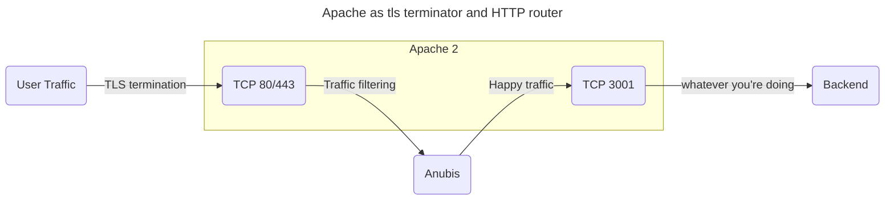

# Apache

import Tabs from "@theme/Tabs";
import TabItem from "@theme/TabItem";

Anubis is intended to be a filter proxy. The way to integrate this is to break your configuration up into two parts: TLS termination and then HTTP routing. Consider this diagram:



Effectively you have one trip through Apache to do TLS termination, a detour through Anubis for traffic scrubbing, and then going to the backend directly. This final socket is what will do HTTP routing.

:::note

These examples assume that you are using a setup where your nginx configuration is made up of a bunch of files in `/etc/httpd/conf.d/*.conf`. This is not true for all deployments of Apache. If you are not in such an environment, append these snippets to your `/etc/httpd/conf/httpd.conf` file.

:::

## Dependencies

Install the following dependencies for proxying HTTP:

<Tabs>
  <TabItem value="rpm" label="Red Hat / RPM" default>

```text
dnf -y install mod_proxy_html
```

  </TabItem>
  <TabItem value="deb" label="Debian / Ubuntu / apt">

```text
apt-get install -y libapache2-mod-proxy-html libxml2-dev
```

  </TabItem>
</Tabs>

## Configuration

Assuming you are protecting `anubistest.techaro.lol`, you need the following server configuration blocks:

1. A block on port 80 that forwards HTTP to HTTPS
2. A block on port 443 that terminates TLS and forwards to Anubis
3. A block on port 3001 that actually serves your websites

```text
# Plain HTTP redirect to HTTPS
<VirtualHost *:80>
       ServerAdmin your@email.here
       ServerName anubistest.techaro.lol
       DocumentRoot /var/www/anubistest.techaro.lol
       ErrorLog /var/log/httpd/anubistest.techaro.lol_error.log
       CustomLog /var/log/httpd/anubistest.techaro.lol_access.log combined
       RewriteEngine on
       RewriteCond %{SERVER_NAME} =anubistest.techaro.lol
       RewriteRule ^ https://%{SERVER_NAME}%{REQUEST_URI} [END,NE,R=permanent]
</VirtualHost>

# HTTPS listener that forwards to Anubis
<VirtualHost *:443>
       ServerAdmin your@email.here
       ServerName anubistest.techaro.lol
       DocumentRoot /var/www/anubistest.techaro.lol
       ErrorLog /var/log/httpd/anubistest.techaro.lol_error.log
       CustomLog /var/log/httpd/anubistest.techaro.lol_access.log combined

       SSLCertificateFile /etc/letsencrypt/live/anubistest.techaro.lol/fullchain.pem
       SSLCertificateKeyFile /etc/letsencrypt/live/anubistest.techaro.lol/privkey.pem
       Include /etc/letsencrypt/options-ssl-apache.conf

       # These headers need to be set or else Anubis will
       # throw an "admin misconfiguration" error.
       RequestHeader set "X-Real-Ip" expr=%{REMOTE_ADDR}
       RequestHeader set X-Forwarded-Proto "https"

       ProxyPreserveHost On

       ProxyRequests Off
       ProxyVia Off

       # Replace 9000 with the port Anubis listens on
       ProxyPass / http://[::1]:9000/
       ProxyPassReverse / http://[::1]:9000/
</VirtualHost>
</IfModule>

# Actual website config
<VirtualHost *:3001>
       ServerAdmin your@email.here
       ServerName anubistest.techaro.lol
       DocumentRoot /var/www/anubistest.techaro.lol
       ErrorLog /var/log/httpd/anubistest.techaro.lol_error.log
       CustomLog /var/log/httpd/anubistest.techaro.lol_access.log combined
</VirtualHost>
```

Make sure to add a separate configuration file for the listener on port 3001:

```text
# /etc/httpd/conf.d/listener-3001.conf

Listen 3001
```

This can be repeated for multiple sites. Anubis does not care about the HTTP `Host` header and will happily cope with multiple websites via the same instance.

Then reload your Apache config and load your website. You should see Anubis protecting your apps!

```text
sudo systemctl reload httpd.service
```

## Troubleshooting

Here are some answers to questions that came in in testing:

### I'm running on a Red Hat distribution and Apache is saying "service unavailable" for every page load

If you see a "Service unavailable" error on every page load and run a Red Hat derived distribution, you are missing a `selinux` setting. The exact command will be in a journalctl log message like this:

```text
*****  Plugin catchall_boolean (89.3 confidence) suggests   ******************

If you want to allow HTTPD scripts and modules to connect to the network using TCP.
Then you must tell SELinux about this by enabling the 'httpd_can_network_connect' boolean.

Do
setsebool -P httpd_can_network_connect 1
```

This will fix the error immediately.
