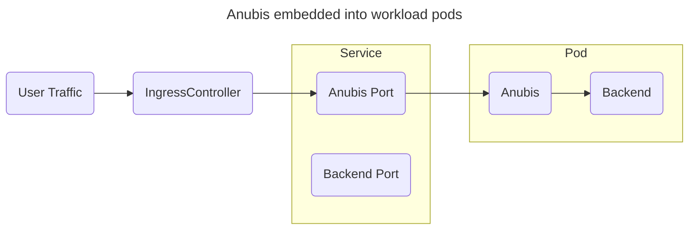

# Kubernetes

When setting up Anubis in Kubernetes, you want to make sure that you thread requests through Anubis kinda like this:



Anubis is lightweight enough that you should be able to have many instances of it running without many problems. If this is a concern for you, please check out [ingress-anubis](https://github.com/jaredallard/ingress-anubis?ref=anubis.techaro.lol).

This example makes the following assumptions:

- Your target service is listening on TCP port `5000`.
- Anubis will be listening on port `8080`.

Adjust these values as facts and circumstances demand.

Create a secret with the signing key Anubis should use for its responses:

```
kubectl create secret generic anubis-key \
  --namespace default \
  --from-literal=ED25519_PRIVATE_KEY_HEX=$(openssl rand -hex 32)
```

Attach Anubis to your Deployment:

```yaml
containers:
  # ...
  - name: anubis
    image: ghcr.io/techarohq/anubis:latest
    imagePullPolicy: Always
    env:
      - name: "BIND"
        value: ":8080"
      - name: "DIFFICULTY"
        value: "4"
      - name: ED25519_PRIVATE_KEY_HEX
        valueFrom:
          secretKeyRef:
            name: anubis-key
            key: ED25519_PRIVATE_KEY_HEX
      - name: "METRICS_BIND"
        value: ":9090"
      - name: "SERVE_ROBOTS_TXT"
        value: "true"
      - name: "TARGET"
        value: "http://localhost:5000"
      - name: "OG_PASSTHROUGH"
        value: "true"
      - name: "OG_EXPIRY_TIME"
        value: "24h"
    resources:
      limits:
        cpu: 750m
        memory: 256Mi
      requests:
        cpu: 250m
        memory: 256Mi
    securityContext:
      runAsUser: 1000
      runAsGroup: 1000
      runAsNonRoot: true
      allowPrivilegeEscalation: false
      capabilities:
        drop:
          - ALL
      seccompProfile:
        type: RuntimeDefault
```

Then add a Service entry for Anubis:

```yaml
# ...
spec:
  ports:
    # diff-add
    - protocol: TCP
      # diff-add
      port: 8080
      # diff-add
      targetPort: 8080
      # diff-add
      name: anubis
```

Then point your Ingress to the Anubis port:

```yaml
  rules:
  - host: git.xeserv.us
    http:
      paths:
      - pathType: Prefix
        path: "/"
        backend:
          service:
            name: git
            port:
              # diff-remove
              name: http
              # diff-add
              name: anubis
```
