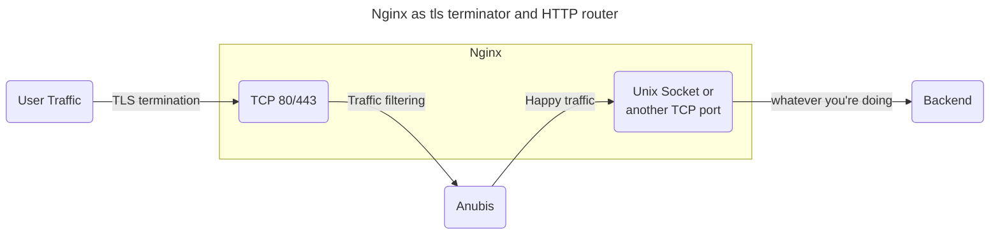

# Nginx

Anubis is intended to be a filter proxy. The way to integrate this with nginx is to break your configuration up into two parts: TLS termination and then HTTP routing. Consider this diagram:



Instead of your traffic going right from TLS termination into the backend, it takes a detour through Anubis. Anubis filters out the "bad" traffic and then passes the "good" traffic to another socket that Nginx has open. This final socket is what you will use to do HTTP routing.

Effectively, you have two roles for nginx: TLS termination (converting HTTPS to HTTP) and HTTP routing (distributing requests to the individual vhosts). This can stack with something like Apache in case you have a legacy deployment. Make sure you have the right [TLS certificates configured](https://code.kuederle.com/letsencrypt/) at the TLS termination level.

:::note

These examples assume that you are using a setup where your nginx configuration is made up of a bunch of files in `/etc/nginx/conf.d/*.conf`. This is not true for all deployments of nginx. If you are not in such an environment, append these snippets to your `/etc/nginx/nginx.conf` file.

:::

Assuming that we are protecting `anubistest.techaro.lol`, here's what the server configuration file would look like:

```nginx
# /etc/nginx/conf.d/server-anubistest-techaro-lol.conf

# HTTP - Redirect all HTTP traffic to HTTPS
server {
	listen 80;
	listen [::]:80;

	server_name anubistest.techaro.lol;

	location / {
		return 301 https://$host$request_uri;
	}
}

# TLS termination server, this will listen over TLS (https) and then
# proxy all traffic to the target via Anubis.
server {
	# Listen on TCP port 443 with TLS (https) and HTTP/2
	listen 443 ssl http2;
	listen [::]:443 ssl http2;

	location / {
    proxy_set_header Host $host;
    proxy_set_header X-Real-IP $remote_addr;
    proxy_pass http://anubis;
  }

	server_name anubistest.techaro.lol;

	ssl_certificate      /path/to/your/certs/anubistest.techaro.lol.crt;
	ssl_certificate_key	 /path/to/your/certs/anubistest.techaro.lol.key;
}

# Backend server, this is where your webapp should actually live.
server {
	listen unix:/run/nginx/nginx.sock;

	server_name anubistest.techaro.lol;
	root "/srv/http/anubistest.techaro.lol";
	index index.html;

	# Your normal configuration can go here
	# location .php { fastcgi...} etc.
}
```

:::tip

You can copy the `location /` block into a separate file named something like `conf-anubis.inc` and then include it inline to other `server` blocks:

```nginx
# /etc/nginx/conf.d/conf-anubis.inc

# Forward to anubis
location / {
  proxy_set_header Host $host;
  proxy_set_header X-Real-IP $remote_addr;
  proxy_pass http://anubis;
}
```

Then in a server block:

<details>
<summary>Full nginx config</summary>

```nginx
# /etc/nginx/conf.d/server-mimi-techaro-lol.conf

server {
	# Listen on 443 with SSL
	listen 443 ssl http2;
	listen [::]:443 ssl http2;

	# Slipstream via Anubis
	include "conf-anubis.inc";

	server_name mimi.techaro.lol;

	ssl_certificate		   /path/to/your/certs/mimi.techaro.lol.crt;
	ssl_certificate_key	 /path/to/your/certs/mimi.techaro.lol.key;
}

server {
	listen unix:/run/nginx/nginx.sock;

	server_name mimi.techaro.lol;
	root "/srv/http/mimi.techaro.lol";
	index index.html;

	# Your normal configuration can go here
	# location .php { fastcgi...} etc.
}
```

</details>

:::

Create an upstream for Anubis.

```nginx
# /etc/nginx/conf.d/upstream-anubis.conf

upstream anubis {
  # Make sure this matches the values you set for `BIND` and `BIND_NETWORK`.
  # If this does not match, your services will not be protected by Anubis.

  # Try anubis first over a UNIX socket
  server unix:/run/anubis/nginx.sock;
  #server http://127.0.0.1:8923;

  # Optional: fall back to serving the websites directly. This allows your
  # websites to be resilient against Anubis failing, at the risk of exposing
  # them to the raw internet without protection. This is a tradeoff and can
  # be worth it in some edge cases.
  #server unix:/run/nginx.sock backup;
}
```

This can be repeated for multiple sites. Anubis does not care about the HTTP `Host` header and will happily cope with multiple websites via the same instance.

Then reload your nginx config and load your website. You should see Anubis protecting your apps!

```text
sudo systemctl reload nginx.service
```
