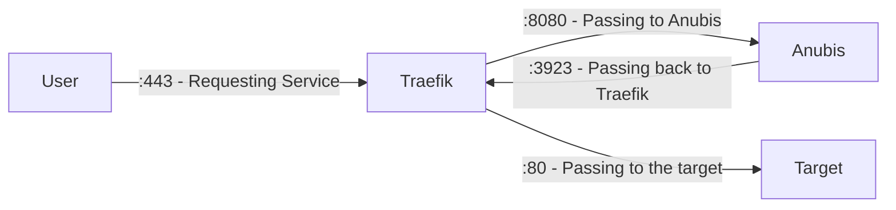

> [!NOTE]
> This only talks about integration through compose,
> but all this is also applies to docker cli options

Currently Anubis doesn't have a Traefik Middleware,
thus it needs you to manually route it between Traefik and your target to protect.
this routing is done per labels in Traefik.

In this Example we will use 4 Containers:

- `traefik` - the Traefik instance
- `anubis` - the Anubis instance
- `target` - Our Service to protect (`traefik/whoami` in this case)
- `target2` - A Second Service that isnt supposed to be protected (`traefik/whoami` in this case)

There are 3 steps we need to follow:

1. Crate a new exclusive Traefik Endpoint for Anubis
2. Pass all unspecified requests to Anubis
3. Let Anubis pass all Verified Requests back to Traefik on its exclusive Endpoint

## Diagram of Flow

This is a small Diagram depicting the Flow.
Keep in Mind that `8080` or `80` can be anything depending on your containers



## Create an Exclusive Anubis Endpoint in Traefik

There are 2 ways of registering a new Endpoint in Traefik.
Which one to use depends on how you configured your Traefik so far.

**CLI Options:**

```yml
--entrypoints.anubis.address=:3923
```

**traefik.yml:**

```yml
entryPoints:
  anubis:
    address: ":3923"
```

It is important that the specified port isn't actually reachable from the outside,
but only exposed in the docker network.
Exposing the Anubis Port on Traefik directly will allow direct unprotected access to all Containers behind it.

## Passing all unspecified Web Requests to Anubis

There are cases where you want Traefik to still route some requests without protection, just like before.
To achieve this we want to register Anubis to take all the "slag"

We also don't want users to get SSL Errors during the checking phase,
thus we also need to let Traefik provide SSL Certs for our Endpoint.
This Example expects an TLS Certresolver called `le`.

We also expect there to be an endpoint called `websecure` for HTTPS in this Example.

This is an example of the needed labels to configure Traefik on the Anubis Container:

```yml
labels:
  - traefik.enable=true # Enabling Traefik
  - traefik.docker.network=traefik # Telling Traefik which network to use
  - traefik.http.routers.anubis.priority=1 # Setting Anubis to the lowest priority, so it only takes the slack
  - traefik.http.routers.anubis.rule=PathRegexp(`.*`) # Wildcard match every path
  - traefik.http.routers.anubis.entrypoints=websecure # Listen on HTTPS
  - traefik.http.services.anubis.loadbalancer.server.port=8080 # Telling Traefik to which port it should route requests
  - traefik.http.routers.anubis.service=anubis # Telling Traefik to use the above specified port
  - traefik.http.routers.anubis.tls.certresolver=le # Telling Traefik to resolve a Cert for Anubis
```

## Passing all Verified Requests Back Correctly to Traefik

For passing verified request back to Traefik,
we only need to configure anubis per its environment:

```yml
environment:
  - BIND=:8080
  - TARGET=http://traefik:3923
```

## Full Example Config

Now that we know how to pass all requests back and forth theres the Example.
This Example contains 2 Services, one protected and the other one isn't.

**compose.yml**

```yml
services:
  traefik:
    image: traefik:v3.3
    ports:
      - 80:80
      - 443:443
    volumes:
      - /var/run/docker.sock:/var/run/docker.sock
      - ./letsencrypt:/letsencrypt
      - ./traefik.yml:/traefik.yml:ro
    networks:
      - traefik
    labels:
      # Enable Traefik
      - traefik.enable=true
      - traefik.docker.network=traefik
      # Redirect any HTTP to HTTPS
      - traefik.http.middlewares.redirect-to-https.redirectscheme.scheme=https
      - traefik.http.routers.web.rule=PathPrefix(`/`)
      - traefik.http.routers.web.entrypoints=web
      - traefik.http.routers.web.middlewares=redirect-to-https
      - traefik.http.routers.web.tls=false

  anubis:
    image: ghcr.io/techarohq/anubis:main
    environment:
      # Telling Anubis, where to listen for Traefik
      - BIND=:8080
      # Telling Anubis to point to Traefik via the Docker network
      - TARGET=http://traefik:3923
    networks:
      - traefik
    labels:
      - traefik.enable=true # Enabeling Traefik
      - traefik.docker.network=traefik # Telling Traefik which network to use
      - traefik.http.routers.anubis.priority=1 # Setting Anubis to the lowest priority, so it only takes the slack
      - traefik.http.routers.anubis.rule=PathRegexp(`.*`) # wildcard match anything
      - traefik.http.routers.anubis.entrypoints=websecure # Liste on HTTPS
      - traefik.http.services.anubis.loadbalancer.server.port=8080 # Telling Traefik to which port it should route requests
      - traefik.http.routers.anubis.service=anubis # Telling Traefik to use the above specified port
      - traefik.http.routers.anubis.tls.certresolver=le # Telling Traefik to resolve a Cert for Anubis

  # Protected by Anubis
  target:
    image: traefik/whoami:latest
    networks:
      - traefik
    labels:
      - traefik.enable=true # Eneabling Traefik
      - traefik.docker.network=traefik # Telling Traefik which network to use
      - traefik.http.routers.target.rule=Host(`example.com`) # Only Matching Requests for example.com
      - traefik.http.routers.target.entrypoints=anubis # Listening on the exclusive Anubis Network
      - traefik.http.services.target.loadbalancer.server.port=80 # Telling Traefik where to receive requests
      - traefik.http.routers.target.service=target # Telling Traegik to use the above specified port

  # Not Protected by Anubis
  target2:
    image: traefik/whoami:latest
    networks:
      - traefik
    labels:
      - traefik.enable=true # Eneabling Traefik
      - traefik.docker.network=traefik # Telling Traefik which network to use
      - traefik.http.routers.target2.rule=Host(`another.com`) # Only Matching Requests for example.com
      - traefik.http.routers.target2.entrypoints=websecure # Listening on the exclusive Anubis Network
      - traefik.http.services.target2.loadbalancer.server.port=80 # Telling Traefik where to receive requests
      - traefik.http.routers.target2.service=target2 # Telling Traegik to use the above specified port
      - traefik.http.routers.target2.tls.certresolver=le # Telling Traefik to resolve a Cert for this Target

networks:
  traefik:
    name: traefik
```

**traefik.yml**

```yml
api:
  insecure: false # shouldnt be enabled in prod

entryPoints:
  # Web
  web:
    address: ":80"
  websecure:
    address: ":443"
  # Anubis
  anubis:
    address: ":3923"

certificatesResolvers:
  le:
    acme:
      tlsChallenge: {}
      email: "admin@example.com"
      storage: "/letsencrypt/acme.json"

providers:
  docker: {}
```
