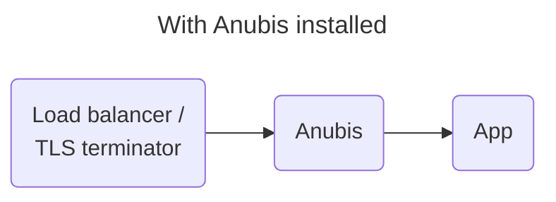
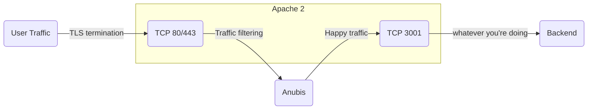
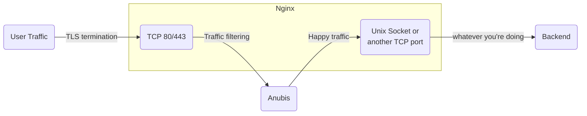

import RandomKey from "@site/src/components/RandomKey";

import Tabs from "@theme/Tabs";
import TabItem from "@theme/TabItem";

Anubis is meant to sit between your reverse proxy (such as Nginx or Caddy) and your target service. One instance of Anubis must be used per service you are protecting.

<center>



</center>

## Docker image conventions

Anubis is shipped in the Docker repo [`ghcr.io/techarohq/anubis`](https://github.com/TecharoHQ/anubis/pkgs/container/anubis). The following tags exist for your convenience:

| Tag                 | Meaning                                                                                                                            |
| :------------------ | :--------------------------------------------------------------------------------------------------------------------------------- |
| `latest`            | The latest [tagged release](https://github.com/TecharoHQ/anubis/releases), if you are in doubt, start here.                        |
| `v<version number>` | The Anubis image for [any given tagged release](https://github.com/TecharoHQ/anubis/tags)                                          |
| `main`              | The current build on the `main` branch. Only use this if you need the latest and greatest features as they are merged into `main`. |

The Docker image runs Anubis as user ID 1000 and group ID 1000. If you are mounting external volumes into Anubis' container, please be sure they are owned by or writable to this user/group.

Anubis has very minimal system requirements. I suspect that 128Mi of ram may be sufficient for a large number of concurrent clients. Anubis may be a poor fit for apps that use WebSockets and maintain open connections, but I don't have enough real-world experience to know one way or another.

## Environment variables

Anubis uses these environment variables for configuration:

| Environment Variable           | Default value           | Explanation                                                                                                                                                                                                                                                                              |
| :----------------------------- | :---------------------- | :--------------------------------------------------------------------------------------------------------------------------------------------------------------------------------------------------------------------------------------------------------------------------------------- |
| `BIND`                         | `:8923`                 | The network address that Anubis listens on. For `unix`, set this to a path: `/run/anubis/instance.sock`                                                                                                                                                                                  |
| `BIND_NETWORK`                 | `tcp`                   | The address family that Anubis listens on. Accepts `tcp`, `unix` and anything Go's [`net.Listen`](https://pkg.go.dev/net#Listen) supports.                                                                                                                                               |
| `COOKIE_DOMAIN`                | unset                   | The domain the Anubis challenge pass cookie should be set to. This should be set to the domain you bought from your registrar (EG: `techaro.lol` if your webapp is running on `anubis.techaro.lol`). See [here](https://stackoverflow.com/a/1063760) for more information.               |
| `COOKIE_PARTITIONED`           | `false`                 | If set to `true`, enables the [partitioned (CHIPS) flag](https://developers.google.com/privacy-sandbox/cookies/chips), meaning that Anubis inside an iframe has a different set of cookies than the domain hosting the iframe.                                                           |
| `DIFFICULTY`                   | `5`                     | The difficulty of the challenge, or the number of leading zeroes that must be in successful responses.                                                                                                                                                                                   |
| `ED25519_PRIVATE_KEY_HEX`      | unset                   | The hex-encoded ed25519 private key used to sign Anubis responses. If this is not set, Anubis will generate one for you. This should be exactly 64 characters long. See below for details.                                                                                               |
| `ED25519_PRIVATE_KEY_HEX_FILE` | unset                   | Path to a file containing the hex-encoded ed25519 private key. Only one of this or its sister option may be set.                                                                                                                                                                         |
| `METRICS_BIND`                 | `:9090`                 | The network address that Anubis serves Prometheus metrics on. See `BIND` for more information.                                                                                                                                                                                           |
| `METRICS_BIND_NETWORK`         | `tcp`                   | The address family that the Anubis metrics server listens on. See `BIND_NETWORK` for more information.                                                                                                                                                                                   |
| `OG_EXPIRY_TIME`               | `24h`                   | The expiration time for the Open Graph tag cache.                                                                                                                                                                                                                                        |
| `OG_PASSTHROUGH`               | `false`                 | If set to `true`, Anubis will enable Open Graph tag passthrough.                                                                                                                                                                                                                         |
| `POLICY_FNAME`                 | unset                   | The file containing [bot policy configuration](./policies.md). See the bot policy documentation for more details. If unset, the default bot policy configuration is used.                                                                                                                |
| `SERVE_ROBOTS_TXT`             | `false`                 | If set `true`, Anubis will serve a default `robots.txt` file that disallows all known AI scrapers by name and then additionally disallows every scraper. This is useful if facts and circumstances make it difficult to change the underlying service to serve such a `robots.txt` file. |
| `SOCKET_MODE`                  | `0770`                  | _Only used when at least one of the `*_BIND_NETWORK` variables are set to `unix`._ The socket mode (permissions) for Unix domain sockets.                                                                                                                                                |
| `TARGET`                       | `http://localhost:3923` | The URL of the service that Anubis should forward valid requests to. Supports Unix domain sockets, set this to a URI like so: `unix:///path/to/socket.sock`.                                                                                                                             |
| `USE_REMOTE_ADDRESS`           | unset                   | If set to `true`, Anubis will take the client's IP from the network socket. For production deployments, it is expected that a reverse proxy is used in front of Anubis, which pass the IP using headers, instead.                                                                        |
| `WEBMASTER_EMAIL`              | unset                   | If set, shows a contact email address when rendering error pages. This email address will be how users can get in contact with administrators.                                                                                                                                           |

For more detailed information on configuring Open Graph tags, please refer to the [Open Graph Configuration](./configuration/open-graph.mdx) page.

### Key generation

To generate an ed25519 private key, you can use this command:

```text
openssl rand -hex 32
```

Alternatively here is a key generated by your browser:

<RandomKey />

## Apache

Anubis is intended to be a filter proxy. The way to integrate this with nginx is to break your configuration up into two parts: TLS termination and then HTTP routing. Consider this diagram:



Effectively you have one trip through Apache to do TLS termination, a detour through Anubis for traffic scrubbing, and then going to the backend directly. This final socket is what will do HTTP routing.

:::note

These examples assume that you are using a setup where your nginx configuration is made up of a bunch of files in `/etc/httpd/conf.d/*.conf`. This is not true for all deployments of Apache. If you are not in such an environment, append these snippets to your `/etc/httpd/conf/httpd.conf` file.

:::

Install the following dependencies:

<Tabs>
  <TabItem value="rpm" label="Red Hat / RPM" default>

```text
dnf -y install mod_proxy_html
```

  </TabItem>
  <TabItem value="deb" label="Debian / Ubuntu / apt">

```text
apt-get install -y libapache2-mod-proxy-html libxml2-dev
```

  </TabItem>
</Tabs>

Assuming you are protecting `anubistest.techaro.lol`, you need the following server configuration blocks:

1. A block on port 80 that forwards HTTP to HTTPS
2. A block on port 443 that terminates TLS and forwards to Anubis
3. A block on port 3001 that actually serves your websites

```text
# Plain HTTP redirect to HTTPS
<VirtualHost *:80>
       ServerAdmin your@email.here
       ServerName anubistest.techaro.lol
       DocumentRoot /var/www/anubistest.techaro.lol
       ErrorLog /var/log/httpd/anubistest.techaro.lol_error.log
       CustomLog /var/log/httpd/anubistest.techaro.lol_access.log combined
       RewriteEngine on
       RewriteCond %{SERVER_NAME} =anubistest.techaro.lol
       RewriteRule ^ https://%{SERVER_NAME}%{REQUEST_URI} [END,NE,R=permanent]
</VirtualHost>

# HTTPS listener that forwards to Anubis
<VirtualHost *:443>
       ServerAdmin your@email.here
       ServerName anubistest.techaro.lol
       DocumentRoot /var/www/anubistest.techaro.lol
       ErrorLog /var/log/httpd/anubistest.techaro.lol_error.log
       CustomLog /var/log/httpd/anubistest.techaro.lol_access.log combined

       SSLCertificateFile /etc/letsencrypt/live/anubistest.techaro.lol/fullchain.pem
       SSLCertificateKeyFile /etc/letsencrypt/live/anubistest.techaro.lol/privkey.pem
       Include /etc/letsencrypt/options-ssl-apache.conf

       # These headers need to be set or else Anubis will
       # throw an "admin misconfiguration" error.
       RequestHeader set "X-Real-Ip" expr=%{REMOTE_ADDR}
       RequestHeader set X-Forwarded-Proto "https"

       ProxyPreserveHost On

       ProxyRequests Off
       ProxyVia Off

       # Replace 9000 with the port Anubis listens on
       ProxyPass / http://[::1]:9000/
       ProxyPassReverse / http://[::1]:9000/
</VirtualHost>
</IfModule>

# Actual website config
<VirtualHost *:3001>
       ServerAdmin your@email.here
       ServerName anubistest.techaro.lol
       DocumentRoot /var/www/anubistest.techaro.lol
       ErrorLog /var/log/httpd/anubistest.techaro.lol_error.log
       CustomLog /var/log/httpd/anubistest.techaro.lol_access.log combined
</VirtualHost>
```

Make sure to add a separate configuration file for the listener on port 3001:

```text
# /etc/httpd/conf.d/listener-3001.conf

Listen 3001
```

This can be repeated for multiple sites. Anubis does not care about the HTTP `Host` header and will happily cope with multiple websites via the same instance.

Then reload your Apache config and load your website. You should see Anubis protecting your apps!

```text
sudo systemctl reload httpd.service
```

### I'm running on a Red Hat distribution and Apache is saying "service unavailable" for every page load

If you see a "Service unavailable" error on every page load and run a Red Hat derived distribution, you are missing a `selinux` setting. The exact command will be in a log message like this:

```text
*****  Plugin catchall_boolean (89.3 confidence) suggests   ******************

If you want to allow HTTPD scripts and modules to connect to the network using TCP.
Then you must tell SELinux about this by enabling the 'httpd_can_network_connect' boolean.

Do
setsebool -P httpd_can_network_connect 1
```

This will fix the error immediately.

## Docker compose

Add Anubis to your compose file pointed at your service:

```yaml
services:
  anubis-nginx:
    image: ghcr.io/techarohq/anubis:latest
    environment:
      BIND: ":8080"
      DIFFICULTY: "5"
      METRICS_BIND: ":9090"
      SERVE_ROBOTS_TXT: "true"
      TARGET: "http://nginx"
      POLICY_FNAME: "/data/cfg/botPolicy.json"
      OG_PASSTHROUGH: "true"
      OG_EXPIRY_TIME: "24h"
    ports:
      - 8080:8080
    volumes:
      - "./botPolicy.json:/data/cfg/botPolicy.json:ro"
  nginx:
    image: nginx
    volumes:
      - "./www:/usr/share/nginx/html"
```

## Kubernetes

This example makes the following assumptions:

- Your target service is listening on TCP port `5000`.
- Anubis will be listening on port `8080`.

Attach Anubis to your Deployment:

```yaml
containers:
  # ...
  - name: anubis
    image: ghcr.io/techarohq/anubis:latest
    imagePullPolicy: Always
    env:
      - name: "BIND"
        value: ":8080"
      - name: "DIFFICULTY"
        value: "5"
      - name: "METRICS_BIND"
        value: ":9090"
      - name: "SERVE_ROBOTS_TXT"
        value: "true"
      - name: "TARGET"
        value: "http://localhost:5000"
      - name: "OG_PASSTHROUGH"
        value: "true"
      - name: "OG_EXPIRY_TIME"
        value: "24h"
    resources:
      limits:
        cpu: 500m
        memory: 128Mi
      requests:
        cpu: 250m
        memory: 128Mi
    securityContext:
      runAsUser: 1000
      runAsGroup: 1000
      runAsNonRoot: true
      allowPrivilegeEscalation: false
      capabilities:
        drop:
          - ALL
      seccompProfile:
        type: RuntimeDefault
```

Then add a Service entry for Anubis:

```yaml
# ...
spec:
  ports:
    # diff-add
    - protocol: TCP
      # diff-add
      port: 8080
      # diff-add
      targetPort: 8080
      # diff-add
      name: anubis
```

Then point your Ingress to the Anubis port:

```yaml
  rules:
  - host: git.xeserv.us
    http:
      paths:
      - pathType: Prefix
        path: "/"
        backend:
          service:
            name: git
            port:
              # diff-remove
              name: http
              # diff-add
              name: anubis
```

## Nginx

Anubis is intended to be a filter proxy. The way to integrate this with nginx is to break your configuration up into two parts: TLS termination and then HTTP routing. Consider this diagram:



Instead of your traffic going right from TLS termination into the backend, it takes a detour through Anubis. Anubis filters out the "bad" traffic and then passes the "good" traffic to another socket that Nginx has open. This final socket is what you will use to do HTTP routing.

Effectively, you have two roles for nginx: TLS termination (converting HTTPS to HTTP) and HTTP routing (distributing requests to the individual vhosts). This can stack with something like Apache in case you have a legacy deployment. Make sure you have the right [TLS certificates configured](https://code.kuederle.com/letsencrypt/) at the TLS termination level.

:::note

These examples assume that you are using a setup where your nginx configuration is made up of a bunch of files in `/etc/nginx/conf.d/*.conf`. This is not true for all deployments of nginx. If you are not in such an environment, append these snippets to your `/etc/nginx/nginx.conf` file.

:::

Assuming that we are protecting `anubistest.techaro.lol`, here's what the server configuration file would look like:

```nginx
# /etc/nginx/conf.d/server-anubistest-techaro-lol.conf

# HTTP - Redirect all HTTP traffic to HTTPS
server {
	listen 80;
	listen [::]:80;

	server_name anubistest.techaro.lol;

	location / {
		return 301 https://$host$request_uri;
	}
}

# TLS termination server, this will listen over TLS (https) and then
# proxy all traffic to the target via Anubis.
server {
	# Listen on TCP port 443 with TLS (https) and HTTP/2
	listen 443 ssl http2;
	listen [::]:443 ssl http2;

	location / {
    proxy_set_header Host $host;
    proxy_set_header X-Real-IP $remote_addr;
    proxy_pass http://anubis;
  }

	server_name anubistest.techaro.lol;

	ssl_certificate      /path/to/your/certs/anubistest.techaro.lol.crt;
	ssl_certificate_key	 /path/to/your/certs/anubistest.techaro.lol.key;
}

# Backend server, this is where your webapp should actually live.
server {
	listen unix:/run/nginx/nginx.sock;

	server_name anubistest.techaro.lol;
	root "/srv/http/anubistest.techaro.lol";
	index index.html;

	# Your normal configuration can go here
	# location .php { fastcgi...} etc.
}
```

:::tip

You can copy the `location /` block into a separate file named something like `conf-anubis.inc` and then include it inline to other `server` blocks:

```nginx
# /etc/nginx/conf.d/conf-anubis.inc

# Forward to anubis
location / {
  proxy_set_header Host $host;
  proxy_set_header X-Real-IP $remote_addr;
  proxy_pass http://anubis;
}
```

Then in a server block:

<details>
<summary>Full nginx config</summary>

```nginx
# /etc/nginx/conf.d/server-mimi-techaro-lol.conf

server {
	# Listen on 443 with SSL
	listen 443 ssl http2;
	listen [::]:443 ssl http2;

	# Slipstream via Anubis
	include "conf-anubis.inc";

	server_name mimi.techaro.lol;

	ssl_certificate		   /path/to/your/certs/mimi.techaro.lol.crt;
	ssl_certificate_key	 /path/to/your/certs/mimi.techaro.lol.key;
}

server {
	listen unix:/run/nginx/nginx.sock;

	server_name mimi.techaro.lol;
	root "/srv/http/mimi.techaro.lol";
	index index.html;

	# Your normal configuration can go here
	# location .php { fastcgi...} etc.
}
```

</details>

:::

Create an upstream for Anubis.

```nginx
# /etc/nginx/conf.d/upstream-anubis.conf

upstream anubis {
  # Make sure this matches the values you set for `BIND` and `BIND_NETWORK`.
  # If this does not match, your services will not be protected by Anubis.

  # Try anubis first over a UNIX socket
  server unix:/run/anubis/nginx.sock;
  #server http://127.0.0.1:8923;

  # Optional: fall back to serving the websites directly. This allows your
  # websites to be resilient against Anubis failing, at the risk of exposing
  # them to the raw internet without protection. This is a tradeoff and can
  # be worth it in some edge cases.
  #server unix:/run/nginx.sock backup;
}
```

This can be repeated for multiple sites. Anubis does not care about the HTTP `Host` header and will happily cope with multiple websites via the same instance.

Then reload your nginx config and load your website. You should see Anubis protecting your apps!

```text
sudo systemctl reload nginx.service
```
