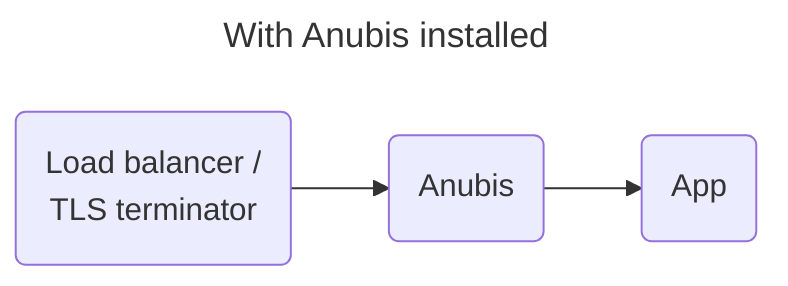

import RandomKey from "@site/src/components/RandomKey";

Anubis is meant to sit between your reverse proxy (such as Nginx or Caddy) and your target service. One instance of Anubis must be used per service you are protecting.

<center>



</center>

Anubis is shipped in the Docker repo [`ghcr.io/techarohq/anubis`](https://github.com/TecharoHQ/anubis/pkgs/container/anubis). The following tags exist for your convenience:

| Tag                 | Meaning                                                                                                                            |
| :------------------ | :--------------------------------------------------------------------------------------------------------------------------------- |
| `latest`            | The latest [tagged release](https://github.com/TecharoHQ/anubis/releases), if you are in doubt, start here.                        |
| `v<version number>` | The Anubis image for [any given tagged release](https://github.com/TecharoHQ/anubis/tags)                                          |
| `main`              | The current build on the `main` branch. Only use this if you need the latest and greatest features as they are merged into `main`. |
| `pr-<number>`       | The build associated with PR `#<number>`. Only use this for debugging issues fixed by a PR.                                        |

Other methods to install Anubis may exist, but the Docker image is currently the only supported method.

The Docker image runs Anubis as user ID 1000 and group ID 1000. If you are mounting external volumes into Anubis' container, please be sure they are owned by or writable to this user/group.

Anubis has very minimal system requirements. I suspect that 128Mi of ram may be sufficient for a large number of concurrent clients. Anubis may be a poor fit for apps that use WebSockets and maintain open connections, but I don't have enough real-world experience to know one way or another.

Anubis uses these environment variables for configuration:

| Environment Variable      | Default value                      | Explanation                                                                                                                                                                                                                                                                              |
| :------------------------ | :--------------------------------- | :--------------------------------------------------------------------------------------------------------------------------------------------------------------------------------------------------------------------------------------------------------------------------------------- |
| `BIND`                    | `:8923`                            | The network address that Anubis listens on. For `unix`, set this to a path: `/run/anubis/instance.sock`                                                                                                                                                                                  |
| `BIND_NETWORK`            | `tcp`                              | The address family that Anubis listens on. Accepts `tcp`, `unix` and anything Go's [`net.Listen`](https://pkg.go.dev/net#Listen) supports.                                                                                                                                               |
| `COOKIE_DOMAIN`           | unset                              | The domain the Anubis challenge pass cookie should be set to. This should be set to the domain you bought from your registrar (EG: `techaro.lol` if your webapp is running on `anubis.techaro.lol`). See [here](https://stackoverflow.com/a/1063760) for more information.               |
| `COOKIE_NAME`             | `within.website-x-cmd-anubis-auth` | The cookie that Anubis uses to determine if users have passed a challenge. This should not be changed without a good reason.                                                                                                                                                             |
| `COOKIE_PARTITIONED`      | `false`                            | If set to `true`, enables the [partitioned (CHIPS) flag](https://developers.google.com/privacy-sandbox/cookies/chips), meaning that Anubis inside an iframe has a different set of cookies than the domain hosting the iframe.                                                           |
| `DIFFICULTY`              | `5`                                | The difficulty of the challenge, or the number of leading zeroes that must be in successful responses.                                                                                                                                                                                   |
| `ED25519_PRIVATE_KEY_HEX` | unset                              | The hex-encoded ed25519 private key used to sign Anubis responses. If this is not set, Anubis will generate one for you. This should be exactly 64 characters long. See below for details.                                                                                               |
| `METRICS_BIND`            | `:9090`                            | The network address that Anubis serves Prometheus metrics on. See `BIND` for more information.                                                                                                                                                                                           |
| `METRICS_BIND_NETWORK`    | `tcp`                              | The address family that the Anubis metrics server listens on. See `BIND_NETWORK` for more information.                                                                                                                                                                                   |
| `SOCKET_MODE`             | `0770`                             | _Only used when at least one of the `*_BIND_NETWORK` variables are set to `unix`._ The socket mode (permissions) for Unix domain sockets.                                                                                                                                                |
| `POLICY_FNAME`            | unset                              | The file containing [bot policy configuration](./policies.md). See the bot policy documentation for more details. If unset, the default bot policy configuration is used.                                                                                                                |
| `SERVE_ROBOTS_TXT`        | `false`                            | If set `true`, Anubis will serve a default `robots.txt` file that disallows all known AI scrapers by name and then additionally disallows every scraper. This is useful if facts and circumstances make it difficult to change the underlying service to serve such a `robots.txt` file. |
| `TARGET`                  | `http://localhost:3923`            | The URL of the service that Anubis should forward valid requests to. Supports Unix domain sockets, set this to a URI like so: `unix:///path/to/socket.sock`.                                                                                                                             |

### Key generation

To generate an ed25519 private key, you can use this command:

```text
openssl rand -hex 32
```

Alternatively here is a key generated by your browser:

<RandomKey />

## Docker compose

Add Anubis to your compose file pointed at your service:

```yaml
services:
  anubis-nginx:
    image: ghcr.io/techarohq/anubis:latest
    environment:
      BIND: ":8080"
      DIFFICULTY: "5"
      METRICS_BIND: ":9090"
      SERVE_ROBOTS_TXT: "true"
      TARGET: "http://nginx"
      POLICY_FNAME: "/data/cfg/botPolicy.json"
    ports:
      - 8080:8080
    volumes:
      - "./botPolicy.json:/data/cfg/botPolicy.json:ro"
  nginx:
    image: nginx
    volumes:
      - "./www:/usr/share/nginx/html"
```

## Kubernetes

This example makes the following assumptions:

- Your target service is listening on TCP port `5000`.
- Anubis will be listening on port `8080`.

Attach Anubis to your Deployment:

```yaml
containers:
  # ...
  - name: anubis
    image: ghcr.io/techarohq/anubis:latest
    imagePullPolicy: Always
    env:
      - name: "BIND"
        value: ":8080"
      - name: "DIFFICULTY"
        value: "5"
      - name: "METRICS_BIND"
        value: ":9090"
      - name: "SERVE_ROBOTS_TXT"
        value: "true"
      - name: "TARGET"
        value: "http://localhost:5000"
    resources:
      limits:
        cpu: 500m
        memory: 128Mi
      requests:
        cpu: 250m
        memory: 128Mi
    securityContext:
      runAsUser: 1000
      runAsGroup: 1000
      runAsNonRoot: true
      allowPrivilegeEscalation: false
      capabilities:
        drop:
          - ALL
      seccompProfile:
        type: RuntimeDefault
```

Then add a Service entry for Anubis:

```yaml
# ...
spec:
  ports:
    # diff-add
    - protocol: TCP
      # diff-add
      port: 8080
      # diff-add
      targetPort: 8080
      # diff-add
      name: anubis
```

Then point your Ingress to the Anubis port:

```yaml
  rules:
  - host: git.xeserv.us
    http:
      paths:
      - pathType: Prefix
        path: "/"
        backend:
          service:
            name: git
            port:
              # diff-remove
              name: http
              # diff-add
              name: anubis
```
