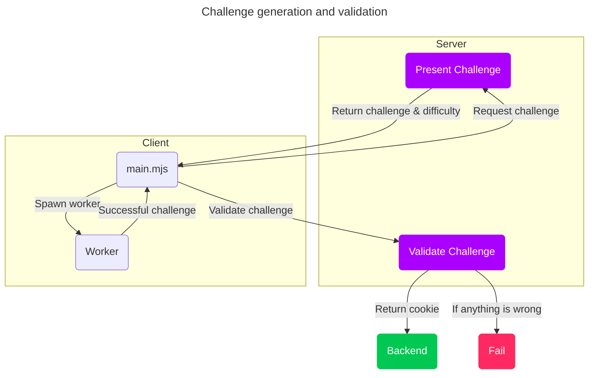
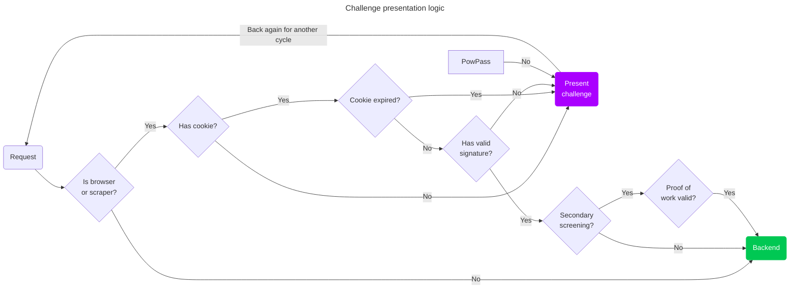

Anubis uses a proof-of-work challenge to ensure that clients are using a modern browser and are able to calculate SHA-256 checksums. Anubis has a customizable difficulty for this proof-of-work challenge, but defaults to 5 leading zeroes.

### Challenge presentation

Anubis decides to present a challenge using this logic:

- User-Agent contains `"Mozilla"`
- Request path is not in `/.well-known`, `/robots.txt`, or `/favicon.ico`
- Request path is not obviously an RSS feed (ends with `.rss`, `.xml`, or `.atom`)

This should ensure that git clients, RSS readers, and other low-harm clients can get through without issue, but high-risk clients such as browsers and AI scraper bots will get blocked.

### Proof of passing challenges

When a client passes a challenge, Anubis sets an HTTP cookie named `"within.website-x-cmd-anubis-auth"` containing a signed [JWT](https://jwt.io/) (JSON Web Token). This JWT contains the following claims:

- `challenge`: The challenge string derived from user request metadata
- `nonce`: The nonce / iteration number used to generate the passing response
- `response`: The hash that passed Anubis' checks
- `iat`: When the token was issued
- `nbf`: One minute prior to when the token was issued
- `exp`: The token's expiry week after the token was issued

This ensures that the token has enough metadata to prove that the token is valid (due to the token's signature), but also so that the server can independently prove the token is valid. This cookie is allowed to be set without triggering an EU cookie banner notification; but depending on facts and circumstances, you may wish to disclose this to your users.

### Challenge format

Challenges are formed by taking some user request metadata and using that to generate a SHA-256 checksum. The following request headers are used:

- `Accept-Encoding`: The content encodings that the requestor supports, such as gzip.
- `Accept-Language`: The language that the requestor would prefer the server respond in, such as English.
- `X-Real-Ip`: The IP address of the requestor, as set by a reverse proxy server.
- `User-Agent`: The user agent string of the requestor.
- The current time in UTC rounded to the nearest week.
- The fingerprint (checksum) of Anubis' private ED25519 key.

This forms a fingerprint of the requestor using metadata that any requestor already is sending. It also uses time as an input, which is known to both the server and requestor due to the nature of linear timelines. Depending on facts and circumstances, you may wish to disclose this to your users.

### JWT signing

Anubis uses an ed25519 keypair to sign the JWTs issued when challenges are passed. Anubis will generate a new ed25519 keypair every time it starts. At this time, there is no way to share this keypair between instance of Anubis, but that will be addressed in future versions.
